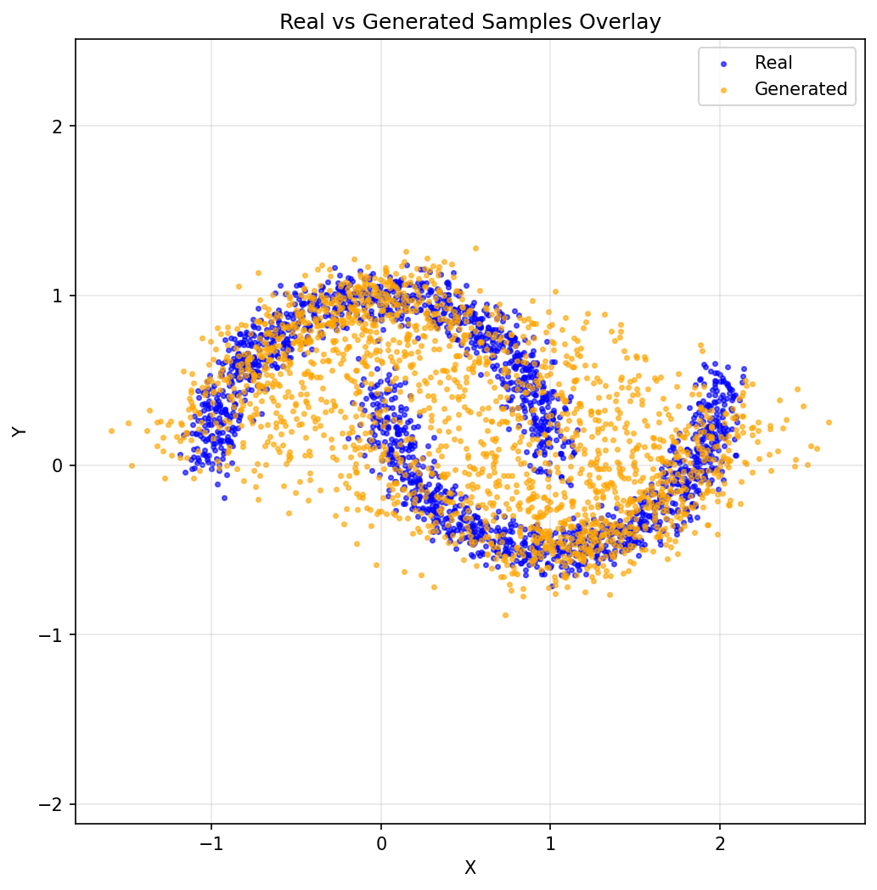

# Technical Report: Diffusion Model for Two Moons Distribution

## 1. Introduction

### 1.1 Project Objectives

The primary goal of this project was to develop a simple test bed for diffusion models and evaluate their effectiveness on the Two Moons distribution from scikit-learn. The specific objectives included:

1. **Baseline Model Development**: Create a simple diffusion model to approximate the Two Moons distribution starting from a 2D Gaussian distribution
2. **Training Implementation**: Implement the DDPM training procedure with noise prediction
3. **Sampling Strategy**: Use Euler sampling for generating new samples from the trained model
4. **Evaluation Framework**: Develop comprehensive metrics and visualization tools
5. **Model Improvement**: Iterate on the baseline to enhance performance

### 1.2 Background

Diffusion models have emerged as a powerful class of generative models that work by gradually denoising data through a learned reverse process. The DDPM framework, introduced by Ho et al. (2020), provides a theoretical foundation for training diffusion models by predicting the noise added during the forward process.

## 2. Methodology

### 2.1 Data Generation

The Two Moons distribution was generated using scikit-learn's `make_moons` function with the following parameters:
```python
X, _ = make_moons(n_samples=10000, noise=0.08, random_state=0)
```

### 2.2 Model Architecture

The baseline model implemented is a **DiffusionMLP** - a simple multi-layer perceptron specifically designed for 2D point data.

**Key Features:**
- Time conditioning through sinusoidal embeddings
- Noise prediction objective 
- Simple architecture suitable for 2D point distributions

### 2.3 Training Procedure

The training follows the standard DDPM framework:

**Forward Process:**
- Add Gaussian noise to data according to a predefined schedule
- Use linear β schedule from 0.0001 to 0.02 over 200 timesteps

**Training Objective:**
- Model predicts the noise ε added during the forward process
- Loss function: Mean Squared Error between predicted and actual noise
- Random timestep sampling during training

**Training Configuration:**
- **Optimizer**: Adam with flat learning rate 0.0002
- **Batch size**: 256
- **Epochs**: 60 

### 2.4 Sampling Strategy

1. Start from pure Gaussian noise
2. Iteratively denoise using the trained model
3. Apply the reverse diffusion process step by step
4. Use the predicted noise to estimate the denoised data

**Sampling Parameters:**
- **Number of samples**: 2,000 for evaluation
- **Timesteps**: 200 (same as training)

## 3. Evaluation Framework

### 3.1 Metrics

The evaluation framework includes multiple complementary metrics:

1. **Maximum Mean Discrepancy (MMD)**: Measures distribution similarity using RBF kernel
2. **Kullback–Leibler divergence**: Measures distribution difference
2. **Mean Difference**: Euclidean distance between sample means
3. **Standard Deviation Difference**: Euclidean distance between sample standard deviations
4. **Coverage Ratio**: How well generated samples cover the real distribution

### 3.2 Visualization

Two types of plots are generated:
1. **Side-by-side scatter plots**: Compare real vs generated distributions
2. **Overlay plots**: Show both distributions on the same axes

## 4. Experiment Setup

Two parameters are being tested and grid-searched

### Hidden size of MLP layer

Varying from 32 to 512

### Number of MLP layers

Varying from 1 to 5

## Experiment Results

With default setup of `hidden_size=128` and `number_layers=2`

| Metric | Value |
|--------|-------|
| MMD | 0.00117 |
| KL Divergence | 7.550 |
| Mean Difference | 0.0213 |
| Standard Deviation Difference | 0.0238 |
| Coverage Ratio | 0.9955 |





